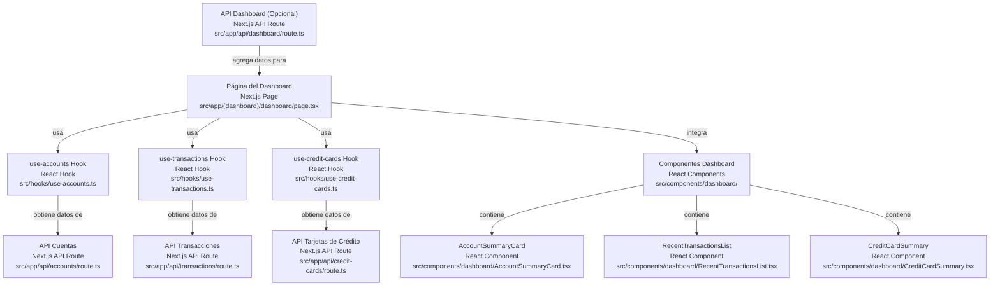
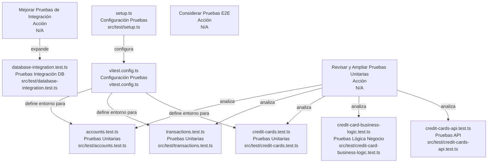
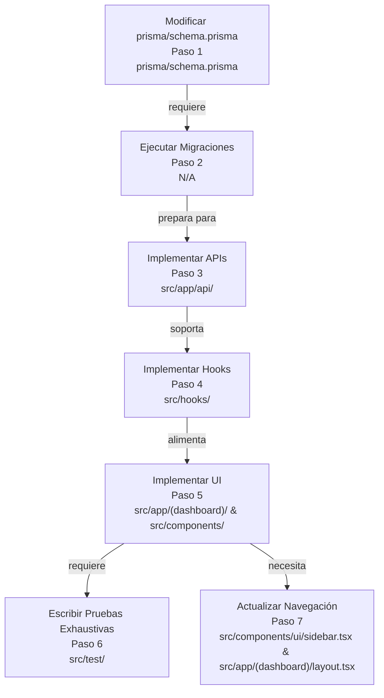

# Codebase Research Report

## Query
Crea una planificación para generar las funcionalidades faltantes del sistema, las cuales son mostrar toda la información relevante en el dashboard, validar la funcionalidad de cuentas, transacciones y tarjetas de crédito, crear funcionalidad de presupuestos, facturas, metas de ahorro, reportes y configuración.

## Answer
# Planificación de Funcionalidades Faltantes

Este informe detalla la planificación para implementar las funcionalidades faltantes en el sistema, siguiendo una estructura modular y replicando los patrones de desarrollo existentes.

## 1. Mejoras en el Dashboard




El objetivo es enriquecer el **dashboard** para mostrar un resumen consolidado de la información financiera clave.

### Componentes y Relaciones

*   **Página del Dashboard**: [src/app/(dashboard)/dashboard/page.tsx](src/app/(dashboard)/dashboard/page.tsx) será el punto central para la visualización de los datos.
*   **Hooks de Datos**: Se utilizarán los hooks existentes para obtener la información necesaria:
    *   Cuentas: [src/hooks/use-accounts.ts](src/hooks/use-accounts.ts)
    *   Transacciones: [src/hooks/use-transactions.ts](src/hooks/use-transactions.ts)
    *   Tarjetas de Crédito: [src/hooks/use-credit-cards.ts](src/hooks/use-credit-cards.ts)
*   **APIs Existentes**: Los hooks se conectan a las APIs correspondientes:
    *   Cuentas: [src/app/api/accounts/route.ts](src/app/api/accounts/route.ts)
    *   Transacciones: [src/app/api/transactions/route.ts](src/app/api/transactions/route.ts)
    *   Tarjetas de Crédito: [src/app/api/credit-cards/route.ts](src/app/api/credit-cards/route.ts)

### Acciones Propuestas

1.  **Modificar la Página del Dashboard**: Actualizar [src/app/(dashboard)/dashboard/page.tsx](src/app/(dashboard)/dashboard/page.tsx) para integrar los nuevos componentes de resumen.
2.  **Crear Componentes de Resumen**: Desarrollar nuevos componentes en un nuevo directorio `src/components/dashboard/` para mostrar la información de manera concisa:
    *   `src/components/dashboard/AccountSummaryCard.tsx`: Resumen de saldos de cuentas.
    *   `src/components/dashboard/RecentTransactionsList.tsx`: Lista de transacciones recientes.
    *   `src/components/dashboard/CreditCardSummary.tsx`: Resumen de saldos y pagos de tarjetas de crédito.
3.  **Optimización de APIs (Opcional)**: Si es necesario, crear una nueva API en `src/app/api/dashboard/route.ts` para agregar datos específicos del dashboard y reducir la carga del cliente.

## 2. Validación de Funcionalidades Existentes (Cuentas, Transacciones, Tarjetas de Crédito)




La validación se centrará en la expansión y mejora de la cobertura de pruebas para las funcionalidades principales.

### Componentes y Relaciones

*   **Archivos de Prueba Existentes**:
    *   Cuentas: [src/test/accounts.test.ts](src/test/accounts.test.ts)
    *   Transacciones: [src/test/transactions.test.ts](src/test/transactions.test.ts)
    *   Tarjetas de Crédito: [src/test/credit-cards.test.ts](src/test/credit-cards.test.ts)
    *   Lógica de Negocio de Tarjetas de Crédito: [src/test/credit-card-business-logic.test.ts](src/test/credit-card-business-logic.test.ts)
    *   APIs de Tarjetas de Crédito: [src/test/credit-cards-api.test.ts](src/test/credit-cards-api.test.ts)
    *   Pruebas de Integración de Base de Datos: [src/test/database-integration.test.ts](src/test/database-integration.test.ts)
*   **Configuración de Pruebas**: [vitest.config.ts](vitest.config.ts) y [src/test/setup.ts](src/test/setup.ts) definen el entorno de pruebas.

### Acciones Propuestas

1.  **Revisar y Ampliar Pruebas Unitarias**:
    *   Analizar [src/test/accounts.test.ts](src/test/accounts.test.ts), [src/test/transactions.test.ts](src/test/transactions.test.ts), y [src/test/credit-cards.test.ts](src/test/credit-cards.test.ts) para identificar áreas con baja cobertura.
    *   Añadir casos de prueba para escenarios de borde, manejo de errores y validaciones de negocio específicas.
2.  **Mejorar Pruebas de Integración**:
    *   Expandir las pruebas en [src/test/database-integration.test.ts](src/test/database-integration.test.ts) para cubrir flujos completos que involucren la interfaz de usuario, las APIs y la base de datos.
    *   Asegurar que las interacciones entre componentes (e.g., creación de una transacción que afecta el saldo de una cuenta) estén correctamente validadas.
3.  **Considerar Pruebas E2E (End-to-End)**: Evaluar la implementación de pruebas E2E (e.g., con Playwright o Cypress) para simular interacciones de usuario reales y validar la funcionalidad de extremo a extremo.

## 3. Creación de Nuevas Funcionalidades

```mermaid
graph TB
  subgraph General Pattern
    prismaSchema["Esquema DB<br>Prisma Schema<br>prisma/schema.prisma"]
    apiRoutes["APIs REST<br>Next.js API Routes<br>src/app/api/"]
    uiPages["Páginas UI<br>Next.js Pages<br>src/app/(dashboard)/"]
    uiComponents["Componentes UI<br>React Components<br>src/components/"]
    customHooks["Hooks Personalizados<br>React Hooks<br>src/hooks/"]
    dataTypes["Tipos de Datos<br>TypeScript Types<br>src/types/"]
    testFiles["Archivos de Prueba<br>Vitest Tests<br>src/test/"]
  end

  subgraph 3.1. Presupuestos (Budgets)
    budgetSchema["Modelo Budget<br>Prisma Schema<br>prisma/schema.prisma"]
    budgetApi["API Budgets<br>Next.js API Route<br>src/app/api/budgets/route.ts"]
    budgetPage["Página Budgets<br>Next.js Page<br>src/app/(dashboard)/budgets/page.tsx"]
    budgetComponents["Componentes Budgets<br>React Components<br>src/components/budgets/"]
    budgetHook["use-budgets Hook<br>React Hook<br>src/hooks/use-budgets.ts"]
    budgetType["Tipo Budget<br>TypeScript Type<br>src/types/budget.ts"]
    budgetTest["Pruebas Budgets<br>Vitest Test<br>src/test/budgets.test.ts"]
  end

  subgraph 3.2. Facturas (Bills)
    billSchema["Modelo Bill<br>Prisma Schema<br>prisma/schema.prisma"]
    billApi["API Bills<br>Next.js API Route<br>src/app/api/bills/route.ts"]
    billPage["Página Bills<br>Next.js Page<br>src/app/(dashboard)/bills/page.tsx"]
    billComponents["Componentes Bills<br>React Components<br>src/components/bills/"]
    billHook["use-bills Hook<br>React Hook<br>src/hooks/use-bills.ts"]
    billType["Tipo Bill<br>TypeScript Type<br>src/types/bill.ts"]
    billTest["Pruebas Bills<br>Vitest Test<br>src/test/bills.test.ts"]
  end

  subgraph 3.3. Metas de Ahorro (Piggy Banks)
    piggySchema["Modelo PiggyBank<br>Prisma Schema<br>prisma/schema.prisma"]
    piggyApi["API Piggy Banks<br>Next.js API Route<br>src/app/api/piggy-banks/route.ts"]
    piggyPage["Página Piggy Banks<br>Next.js Page<br>src/app/(dashboard)/piggy-banks/page.tsx"]
    piggyComponents["Componentes Piggy Banks<br>React Components<br>src/components/piggy-banks/"]
    piggyHook["use-piggy-banks Hook<br>React Hook<br>src/hooks/use-piggy-banks.ts"]
    piggyType["Tipo Piggy Bank<br>TypeScript Type<br>src/types/piggy-bank.ts"]
    piggyTest["Pruebas Piggy Banks<br>Vitest Test<br>src/test/piggy-banks.test.ts"]
  end

  subgraph 3.4. Reportes (Reports)
    reportApi["API Reports<br>Next.js API Route<br>src/app/api/reports/route.ts"]
    reportPage["Página Reports<br>Next.js Page<br>src/app/(dashboard)/reports/page.tsx"]
    reportComponents["Componentes Reports<br>React Components<br>src/components/reports/"]
    chartComponents["Componentes Charts<br>React Components<br>src/components/charts/"]
    reportHook["use-reports Hook<br>React Hook<br>src/hooks/use-reports.ts"]
    reportType["Tipo Report<br>TypeScript Type<br>src/types/report.ts"]
    reportTest["Pruebas Reports<br>Vitest Test<br>src/test/reports.test.ts"]
  end

  subgraph 3.5. Configuración (Settings)
    settingSchema["Modelo UserSetting (Opcional)<br>Prisma Schema<br>prisma/schema.prisma"]
    settingApi["API Settings<br>Next.js API Route<br>src/app/api/settings/route.ts"]
    settingPage["Página Settings<br>Next.js Page<br>src/app/(dashboard)/settings/page.tsx"]
    settingComponents["Componentes Settings<br>React Components<br>src/components/settings/"]
    settingHook["use-settings Hook<br>React Hook<br>src/hooks/use-settings.ts"]
    settingType["Tipo Setting<br>TypeScript Type<br>src/types/setting.ts"]
    settingTest["Pruebas Settings<br>Vitest Test<br>src/test/settings.test.ts"]
  end

  budgetSchema --> |"define"| budgetApi
  budgetApi --> |"usa"| budgetHook
  budgetHook --> |"provee datos a"| budgetPage
  budgetPage --> |"usa"| budgetComponents
  budgetType --> |"define estructura para"| budgetHook
  budgetTest --> |"valida"| budgetApi

  billSchema --> |"define"| billApi
  billApi --> |"usa"| billHook
  billHook --> |"provee datos a"| billPage
  billPage --> |"usa"| billComponents
  billType --> |"define estructura para"| billHook
  billTest --> |"valida"| billApi

  piggySchema --> |"define"| piggyApi
  piggyApi --> |"usa"| piggyHook
  piggyHook --> |"provee datos a"| piggyPage
  piggyPage --> |"usa"| piggyComponents
  piggyType --> |"define estructura para"| piggyHook
  piggyTest --> |"valida"| piggyApi

  reportApi --> |"usa"| reportHook
  reportHook --> |"provee datos a"| reportPage
  reportPage --> |"usa"| reportComponents
  reportComponents --> |"usa"| chartComponents
  reportType --> |"define estructura para"| reportHook
  reportTest --> |"valida"| reportApi

  settingSchema --> |"define (opcional)"| settingApi
  settingApi --> |"usa"| settingHook
  settingHook --> |"provee datos a"| settingPage
  settingPage --> |"usa"| settingComponents
  settingType --> |"define estructura para"| settingHook
  settingTest --> |"valida"| settingApi
```


Para cada nueva funcionalidad (Presupuestos, Facturas, Metas de Ahorro, Reportes, Configuración), se seguirá un patrón de desarrollo consistente, que incluye:

*   **Esquema de Base de Datos**: Modificación de [prisma/schema.prisma](prisma/schema.prisma) y ejecución de migraciones.
*   **APIs REST**: Creación de nuevas rutas en `src/app/api/`.
*   **Páginas de UI**: Desarrollo de nuevas páginas en `src/app/(dashboard)/`.
*   **Componentes de UI**: Creación de componentes reutilizables en `src/components/`.
*   **Hooks Personalizados**: Implementación de hooks en `src/hooks/` para la lógica de datos.
*   **Tipos de Datos**: Definición de nuevos tipos en `src/types/`.
*   **Pruebas**: Creación de archivos de prueba en `src/test/`.

### 3.1. Presupuestos (Budgets)

*   **Esquema**: Añadir modelo `Budget` a [prisma/schema.prisma](prisma/schema.prisma).
*   **API**: Crear `src/app/api/budgets/route.ts` para operaciones CRUD.
*   **Página UI**: Crear [src/app/(dashboard)/budgets/page.tsx](src/app/(dashboard)/budgets/page.tsx).
*   **Componentes UI**: Crear `src/components/budgets/BudgetForm.tsx` y `src/components/budgets/BudgetList.tsx`.
*   **Hook**: Crear `src/hooks/use-budgets.ts`.
*   **Tipo**: Crear `src/types/budget.ts`.
*   **Pruebas**: Crear `src/test/budgets.test.ts`.

### 3.2. Facturas (Bills)

*   **Esquema**: Añadir modelo `Bill` a [prisma/schema.prisma](prisma/schema.prisma).
*   **API**: Crear `src/app/api/bills/route.ts` para operaciones CRUD.
*   **Página UI**: Crear [src/app/(dashboard)/bills/page.tsx](src/app/(dashboard)/bills/page.tsx).
*   **Componentes UI**: Crear `src/components/bills/BillForm.tsx` y `src/components/bills/BillList.tsx`.
*   **Hook**: Crear `src/hooks/use-bills.ts`.
*   **Tipo**: Crear `src/types/bill.ts`.
*   **Pruebas**: Crear `src/test/bills.test.ts`.

### 3.3. Metas de Ahorro (Piggy Banks / Savings Goals)

*   **Esquema**: Añadir modelo `PiggyBank` o `SavingsGoal` a [prisma/schema.prisma](prisma/schema.prisma).
*   **API**: Crear `src/app/api/piggy-banks/route.ts` para operaciones CRUD.
*   **Página UI**: La página [src/app/(dashboard)/piggy-banks/page.tsx](src/app/(dashboard)/piggy-banks/page.tsx) ya existe y será actualizada.
*   **Componentes UI**: Crear `src/components/piggy-banks/PiggyBankForm.tsx` y `src/components/piggy-banks/PiggyBankList.tsx`.
*   **Hook**: Crear `src/hooks/use-piggy-banks.ts`.
*   **Tipo**: Crear `src/types/piggy-bank.ts`.
*   **Pruebas**: Crear `src/test/piggy-banks.test.ts`.

### 3.4. Reportes (Reports)

*   **Esquema**: No se requieren nuevos modelos de esquema, ya que los reportes agregan datos existentes.
*   **API**: Crear `src/app/api/reports/route.ts` para generar datos de reportes (e.g., gastos por categoría, ingresos vs. egresos). Esto podría implicar consultas complejas a la base de datos.
*   **Página UI**: La página [src/app/(dashboard)/reports/page.tsx](src/app/(dashboard)/reports/page.tsx) ya existe y será actualizada.
*   **Componentes UI**: Crear componentes de visualización de datos en `src/components/reports/` (e.g., `src/components/reports/SpendingByCategoryChart.tsx`, `src/components/reports/IncomeExpenseChart.tsx`), posiblemente utilizando el directorio [src/components/charts/](src/components/charts/).
*   **Hook**: Crear `src/hooks/use-reports.ts`.
*   **Tipo**: Crear `src/types/report.ts` para las estructuras de datos de los reportes.
*   **Pruebas**: Crear `src/test/reports.test.ts` para validar la lógica de generación de datos de reportes.

### 3.5. Configuración (Settings)

*   **Esquema**: Posiblemente añadir un modelo `UserSetting` a [prisma/schema.prisma](prisma/schema.prisma) para preferencias de usuario.
*   **API**: Crear `src/app/api/settings/route.ts` para gestionar la configuración del usuario.
*   **Página UI**: La página [src/app/(dashboard)/settings/page.tsx](src/app/(dashboard)/settings/page.tsx) ya existe y será actualizada.
*   **Componentes UI**: Crear componentes de formulario y visualización en `src/components/settings/` (e.g., `src/components/settings/ProfileSettingsForm.tsx`, `src/components/settings/NotificationSettings.tsx`).
*   **Hook**: Crear `src/hooks/use-settings.ts`.
*   **Tipo**: Crear `src/types/setting.ts`.
*   **Pruebas**: Crear `src/test/settings.test.ts`.

## 4. Pasos Generales para la Implementación




1.  **Migraciones de Prisma**: Después de cada modificación a [prisma/schema.prisma](prisma/schema.prisma), ejecutar `npx prisma migrate dev --name <nombre_de_migracion>`.
2.  **Implementación de APIs**: Desarrollar la lógica de negocio y las operaciones de base de datos para las nuevas rutas de API.
3.  **Implementación de Hooks**: Crear los hooks personalizados para la interacción con las nuevas APIs.
4.  **Implementación de UI**: Diseñar e implementar las páginas y componentes de la interfaz de usuario.
5.  **Pruebas Exhaustivas**: Escribir pruebas unitarias, de integración y, si es posible, E2E para cada nueva funcionalidad.
6.  **Actualización de Navegación**: Modificar el componente de la barra lateral [src/components/ui/sidebar.tsx](src/components/ui/sidebar.tsx) o el layout principal [src/app/(dashboard)/layout.tsx](src/app/(dashboard)/layout.tsx) para incluir enlaces a las nuevas páginas.